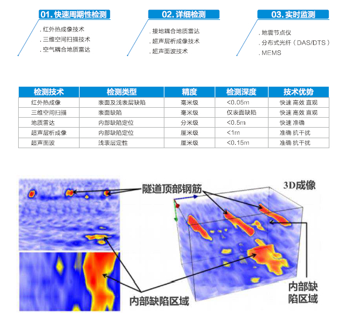
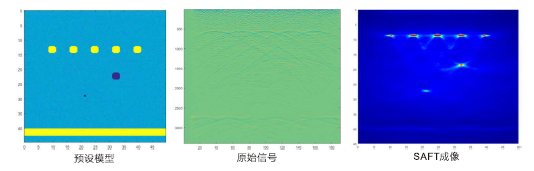

3.2 无损检测技术
>>>>>>>>>>>>>>>>>>>>>>>

3.2.1 混凝土检测技术体系构建
::::::::::::::::::::::::::::::::::

3.2.2 无损检测自主研发技术介绍
::::::::::::::::::::::::::::::::::

-  **基于无损检测的阵列式异位接收超声波合成孔径聚焦算法**

``*`` 为了解决混凝土无损检测中传统B扫描分辨率较低，
难以对很多内部异常进行准确定位的问题。

``*`` 本专利设计了一种新型阵列式异位接收SAFT成像算法，
获取的图像分辨率更高，内部结构定位更加准确，同时提离了探测效率，
节约了成本。

-  **基于排列式超声震源的混凝土浅表层超声面波检测方法**

   .. figure:: _static/images/Ultrasonic_surface_wave.jpg
      :alt: 超声面波

``*`` 为了解决混凝土无损检测中传统方法判断标准过千主观、 精度相对较低、
稳定性差等问题。

``*`` 本专利开发了一种可在无损条件下，
对混凝土构件浅表层缺陷进行检测的技术。通过分析信号相干及相差谱，计算面波的窄带频散曲线得到被测对象浅表层平均杨氏模量，即可实现对缺陷的快速、准确定位。