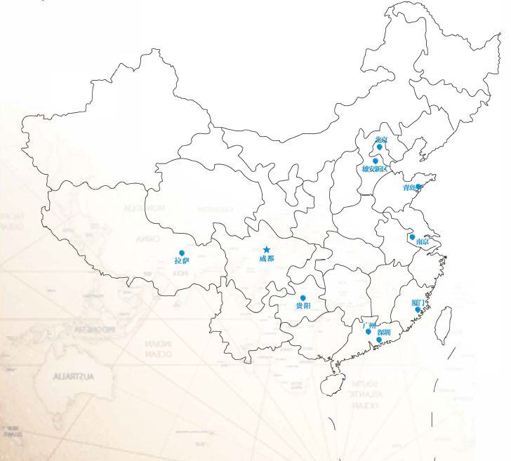

=============================
第二章：案例展示
=============================

2 案例展示
-----------------------------

* 广州白云区某广场岩溶探测
* 深圳某地铁始发和接受端头加固
* 厦门某地铁基岩凸起及”孤石“探测
* 贵阳某地铁岩溶探测
* 成都机场滑行跑道及停机坪空洞探测、滞后沉降监测
* 深圳某地铁岩溶探测
* 北京某地铁空洞排查
* 北京某区块地质安全评估
* 南京某地铁岩溶探测
* 青岛某地铁注浆效果评测
* 雄安新区地质情况调查
* 川藏线地质情况调查

-------------------

.. toctree::
   :maxdepth: 1
   :glob:

   ../c02/*

--------------

.. image:: _static/logo.png
   :height: 75px
   :width: 200px